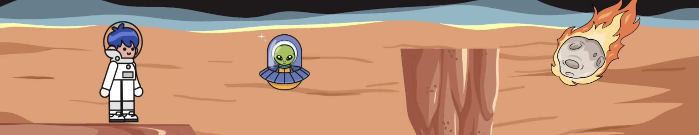

# Hi, I'm Andrea 👋🏻👩🏻‍💻

## About me

## Tech Stack

## My projects

### Viaje a marte

 
A platform game where you have to capture 20 aliens in 2 minutes, be careful not to touch the meteorites! 
Developed with: JavaScript, HTML & CSS (check the repo <a href="https://github.com/AndreaAlarcon99/juegoPlataformas">here</a>).

### Adopta una huella

 
Es una web de adopción de mascotas en línea diseñada para aumentar las tasas de adopción de mascotas de los refugios proporcionando una experiencia fácil de usar y personalizada para ayudar a los adoptantes a encontrar la mascota adecuada.  
Developed with: JavaScript, Node, Express, Mongo & React (check the repo <a href="https://github.com/AndreaAlarcon99/adopta-una-huella-FRONT">here</a>).
